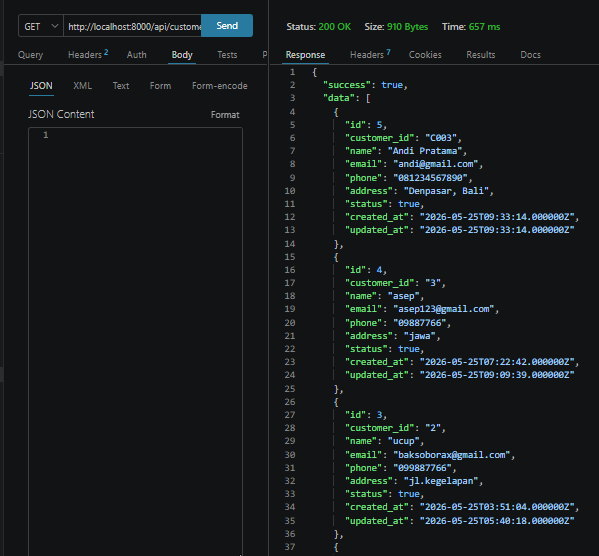
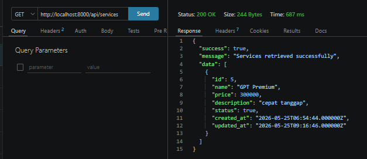
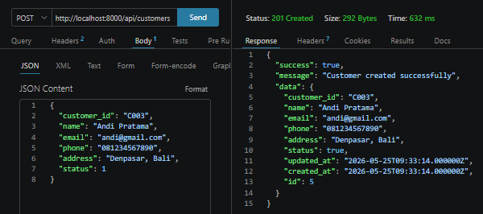
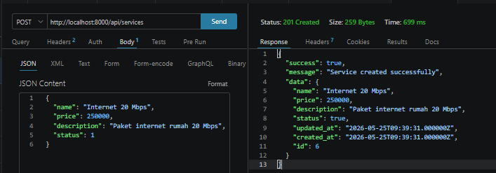
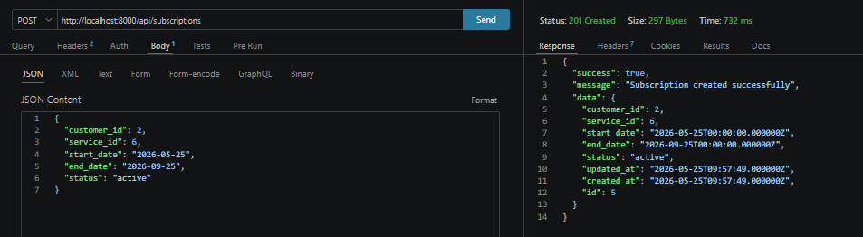
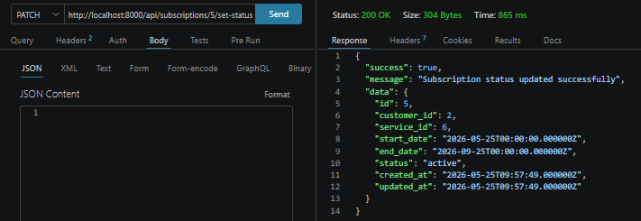
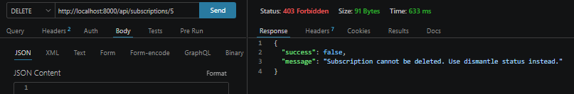

````md
# Final Project Laravel ERP

## Identitas Mahasiswa

- **Nama:** Febrian Maulana Labib
- **NIM:** 2415354086
- **Kelas:** TRPL B
- **Repository:** https://github.com/Febri-html/final-project-laravel-2415354086

---

## Deskripsi Project

Project ini merupakan aplikasi **ERP sederhana berbasis Laravel** yang digunakan untuk mengelola data **Customers**, **Services**, dan **Subscriptions**.

Aplikasi ini memiliki dua bagian utama:

1. **Dashboard Web**
   - Digunakan untuk mengelola data melalui tampilan Blade.
   - Memiliki fitur tambah data, edit data, hapus data tertentu, dan ubah status.

2. **REST API**
   - Digunakan untuk pengujian backend menggunakan Thunder Client.
   - API mendukung operasi CRUD dan update status.

---

## Fitur Aplikasi

### 1. Customers

Fitur Customers digunakan untuk mengelola data pelanggan.

Fitur yang tersedia:

- Menampilkan data customer
- Menambah customer
- Mengedit customer
- Menghapus customer
- Mengubah status customer menjadi Active atau Inactive

### 2. Services

Fitur Services digunakan untuk mengelola layanan yang tersedia.

Fitur yang tersedia:

- Menampilkan data service
- Menambah service
- Mengedit service
- Menghapus service
- Mengubah status service menjadi Active atau Inactive

### 3. Subscriptions

Fitur Subscriptions digunakan untuk mengelola data langganan customer terhadap service tertentu.

Fitur yang tersedia:

- Menampilkan data subscription
- Menambah subscription
- Mengedit subscription
- Mengubah status subscription:
  - Active
  - Inactive / Deactivate
  - Trial
  - Isolir
  - Dismantle

Pada fitur subscription, data tidak dihapus secara permanen. Jika langganan sudah selesai, status diubah menjadi **Dismantle**. Subscription dengan status **Dismantle** dianggap final sehingga tidak dapat diubah kembali.

---

## Teknologi yang Digunakan

- Laravel
- PHP
- MySQL
- Blade Template
- Thunder Client
- Git & GitHub
- Laragon

---

## Cara Menjalankan Project

### 1. Clone Repository

```bash
git clone https://github.com/Febri-html/final-project-laravel-2415354086.git
````

### 2. Masuk ke Folder Project

```bash
cd final-project-laravel-2415354086
```

### 3. Install Dependency

```bash
composer install
```

### 4. Copy File Environment

```bash
copy .env.example .env
```

### 5. Generate Application Key

```bash
php artisan key:generate
```

### 6. Atur Database

Sesuaikan konfigurasi database pada file `.env`.

Contoh:

```env
DB_DATABASE=erp_app
DB_USERNAME=root
DB_PASSWORD=
```

### 7. Jalankan Migration

```bash
php artisan migrate
```

### 8. Jalankan Server

```bash
php artisan serve
```

Akses aplikasi melalui:

```txt
http://localhost:8000
```

---

## Tampilan Dashboard

### Dashboard Customers



### Dashboard Services



### Dashboard Subscriptions


---

## Web Routes

| Method | Endpoint                        | Keterangan                        |
| ------ | ------------------------------- | --------------------------------- |
| GET    | `/`                             | Menampilkan halaman customers     |
| GET    | `/customers-page`               | Menampilkan halaman customers     |
| GET    | `/services-page`                | Menampilkan halaman services      |
| GET    | `/subscriptions-page`           | Menampilkan halaman subscriptions |
| POST   | `/customers-store`              | Menambah customer                 |
| PUT    | `/customers-update/{id}`        | Mengupdate customer               |
| PUT    | `/customers-setstatus/{id}`     | Mengubah status customer          |
| DELETE | `/customers-delete/{id}`        | Menghapus customer                |
| POST   | `/services-store`               | Menambah service                  |
| PUT    | `/services-update/{id}`         | Mengupdate service                |
| PUT    | `/services-setstatus/{id}`      | Mengubah status service           |
| DELETE | `/services-delete/{id}`         | Menghapus service                 |
| POST   | `/subscriptions-store`          | Menambah subscription             |
| PUT    | `/subscriptions-update/{id}`    | Mengupdate subscription           |
| PUT    | `/subscriptions-setstatus/{id}` | Mengubah status subscription      |

---

## API Routes

Base URL:

```txt
http://localhost:8000/api
```

### Customers API

| Method    | Endpoint                     | Keterangan                  |
| --------- | ---------------------------- | --------------------------- |
| GET       | `/customers`                 | Menampilkan semua customer  |
| POST      | `/customers`                 | Menambah customer           |
| GET       | `/customers/{id}`            | Menampilkan detail customer |
| PUT/PATCH | `/customers/{id}`            | Mengupdate customer         |
| DELETE    | `/customers/{id}`            | Menghapus customer          |
| PATCH     | `/customers/{id}/set-status` | Mengubah status customer    |

### Services API

| Method    | Endpoint                    | Keterangan                 |
| --------- | --------------------------- | -------------------------- |
| GET       | `/services`                 | Menampilkan semua service  |
| POST      | `/services`                 | Menambah service           |
| GET       | `/services/{id}`            | Menampilkan detail service |
| PUT/PATCH | `/services/{id}`            | Mengupdate service         |
| DELETE    | `/services/{id}`            | Menghapus service          |
| PATCH     | `/services/{id}/set-status` | Mengubah status service    |

### Subscriptions API

| Method    | Endpoint                         | Keterangan                                |
| --------- | -------------------------------- | ----------------------------------------- |
| GET       | `/subscriptions`                 | Menampilkan semua subscription            |
| POST      | `/subscriptions`                 | Menambah subscription                     |
| GET       | `/subscriptions/{id}`            | Menampilkan detail subscription           |
| PUT/PATCH | `/subscriptions/{id}`            | Mengupdate subscription                   |
| DELETE    | `/subscriptions/{id}`            | Tidak diizinkan, gunakan status dismantle |
| PATCH     | `/subscriptions/{id}/set-status` | Mengubah status subscription              |

---

## Contoh Pengujian API Menggunakan Thunder Client

### 1. GET Customers

```http
GET http://localhost:8000/api/customers
```


---

### 2. POST Customer

```http
POST http://localhost:8000/api/customers
```

Body JSON:

```json
{
  "customer_id": "C003",
  "name": "Andi Pratama",
  "email": "andi@gmail.com",
  "phone": "081234567890",
  "address": "Denpasar, Bali",
  "status": 1
}
```



---

### 3. GET Services

```http
GET http://localhost:8000/api/services
```


---

### 4. POST Service

```http
POST http://localhost:8000/api/services
```

Body JSON:

```json
{
  "name": "Internet 20 Mbps",
  "price": 250000,
  "description": "Paket internet rumah 20 Mbps",
  "status": 1
}
```



---

### 5. GET Subscriptions

```http
GET http://localhost:8000/api/subscriptions
```


---

### 6. POST Subscription

```http
POST http://localhost:8000/api/subscriptions
```

Body JSON:

```json
{
  "customer_id": 1,
  "service_id": 1,
  "start_date": "2026-05-25",
  "end_date": "2026-06-25",
  "status": "active"
}
```

Catatan: `customer_id` dan `service_id` harus menggunakan ID yang sudah tersedia di database.



---

### 7. PATCH Subscription Status Menjadi Dismantle

```http
PATCH http://localhost:8000/api/subscriptions/1/set-status
```

Body JSON:

```json
{
  "status": "dismantle"
}
```



---

### 8. DELETE Subscription Tidak Diizinkan

```http
DELETE http://localhost:8000/api/subscriptions/1
```

Subscription tidak dihapus secara permanen. Jika subscription sudah selesai, status harus diubah menjadi **dismantle**.



---

## Aturan Bisnis Subscription

Pada aplikasi ini, data subscription tidak boleh dihapus secara permanen karena subscription merupakan data transaksi atau riwayat langganan customer.

Jika customer berhenti berlangganan, maka status subscription diubah menjadi:

```txt
dismantle
```

Jika subscription sudah berstatus **dismantle**, maka data tersebut tidak dapat diaktifkan kembali atau diubah statusnya melalui dashboard maupun API.

---

## Dokumentasi Commit

Project ini dikerjakan menggunakan Git dan GitHub. Setiap sub-fitur yang selesai dibuat akan di-commit dan di-push ke repository agar sesuai dengan praktik kerja industri.

Beberapa commit yang telah dilakukan:

```txt
fix service and subscription actions
fix customer status action and protect subscription deletion
```

---

## Kesimpulan

Aplikasi ERP sederhana ini berhasil dibuat untuk mengelola data Customers, Services, dan Subscriptions. Selain menyediakan dashboard berbasis web, project ini juga menyediakan REST API yang dapat diuji menggunakan Thunder Client.

Fitur subscription dibuat dengan aturan bisnis khusus, yaitu data subscription tidak dihapus secara permanen, melainkan diubah statusnya menjadi dismantle.

````

---


